# CREAR REDES VIRTUALES EN AZURE

## GRUPO DE RECURSOS

Creamos un grupo de recursos donde guardar nuestra red virtual, las máquinas y su configuración en la red.

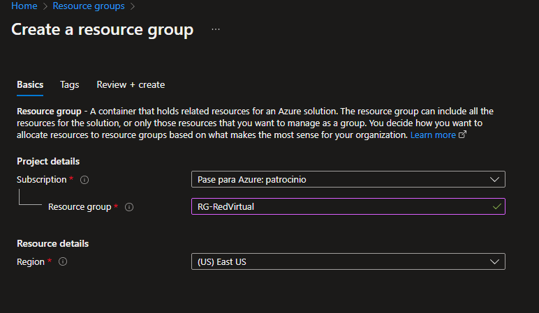

## RED VIRTUAL

Dentro del grupo de recursos añadimos un "virtual networks" donde configuraremos la red y subredes.

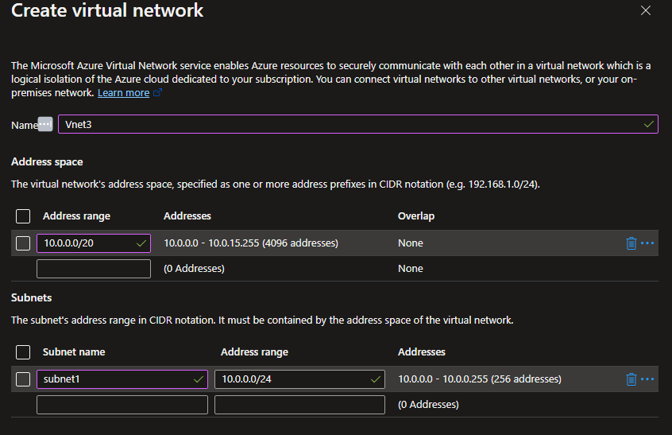

## MÁQUINAS VIRTUALES

### WINDOWS SERVER 2019 DATACENTER

Creamos una máquina virtual de Windows Server 2019 DATACENTER dentro del grupo de recursos.

Podemos cambiar la infraestructura, el disco, acceder por SSH o con usuario y contraseña y abrir puertos.

En este caso usaremos el usuario y contraseña y abriremos los puertos 80,22 y 3389.

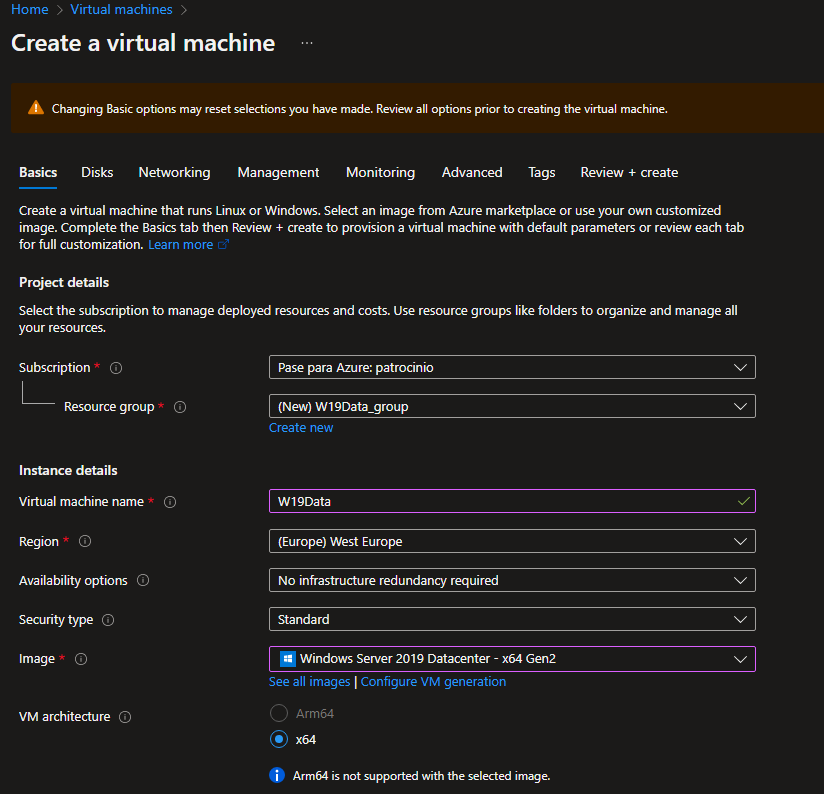

Dentro de la pestaña Networking seleccionaremos la red virtual anteriormente creada y la subred que queramos y crearemos una IP pública.

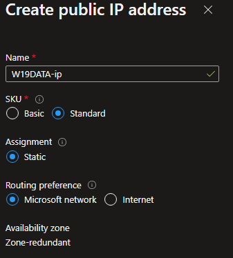

Dentro de la pestaña Tags
donde crearemos la etiqueta de departamento: marketing, para esta máquina y sus recursos.

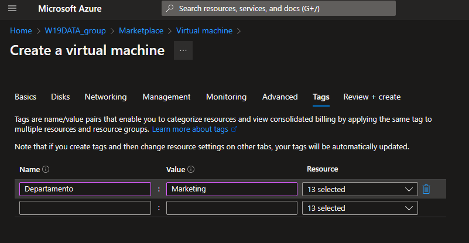

### WINDOWS 10 PRO

El Windows 10 PRO lo crearemos y configuraremos de la misma manera menos abrir el puerto 80.

> Hay que confirmar que tienes la licencia.

## DIAGRAMA

Hasta ahora el diagrama del grupo de recursos sería este:

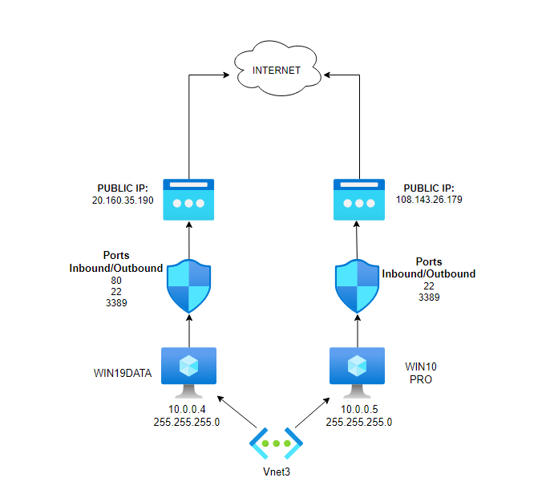

## WINDOWS ADMIN CENTER

Instalaremos el WAC en nuestra máquina local y en el WIN19DATA.

[Descargamos Windows admin center](https://www.microsoft.com/es-es/evalcenter/download-windows-admin-center)

Durante la instalación puede dar un error de "transformación" para ello ejecútalo desde el terminal:
> msiexec -i WindowsAdminCenter2211.msi productLanguage="1033"

Añadiremos la máquina WIN19DATA dentro del WAC.

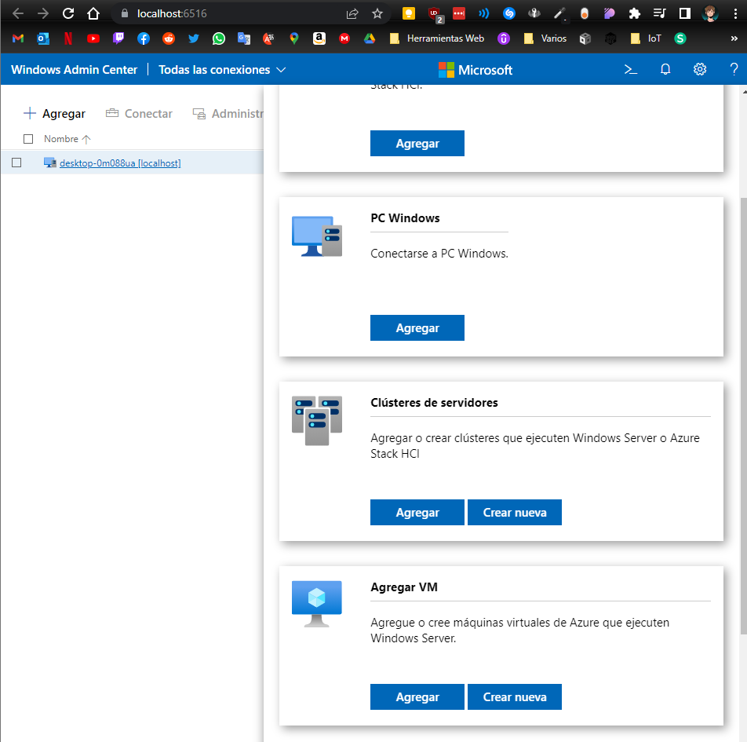

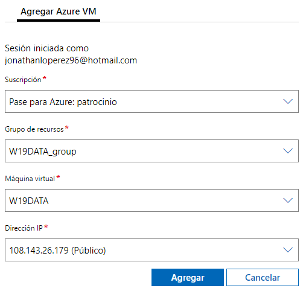

> Necesitas conectar con la cuenta de Azure portal. Dentro de Configuración -> Cuenta.

Aún no podemos conectar porque no hemos instalado el WAC en WIN19DATA.

Dentro de W19DATA en el portal de Azure, en Settings encontramos la configuración del Windows Admin Center.

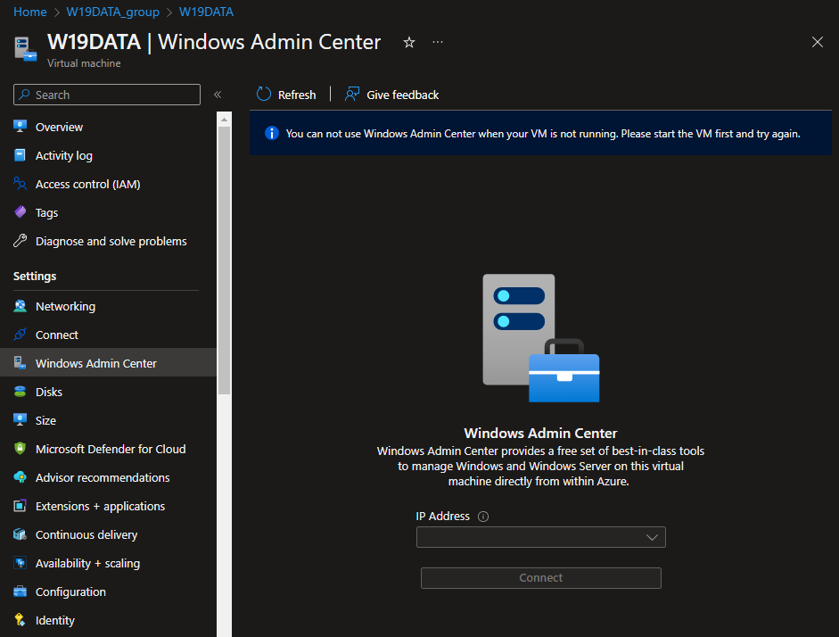

Lo instalamos y añadimos permisos para el usuario.

Nos conectamos a la máquina via escritorio remoto.

Dentro del Server Manager -> Local Server, revisamos que la administración remota esta habilitada.

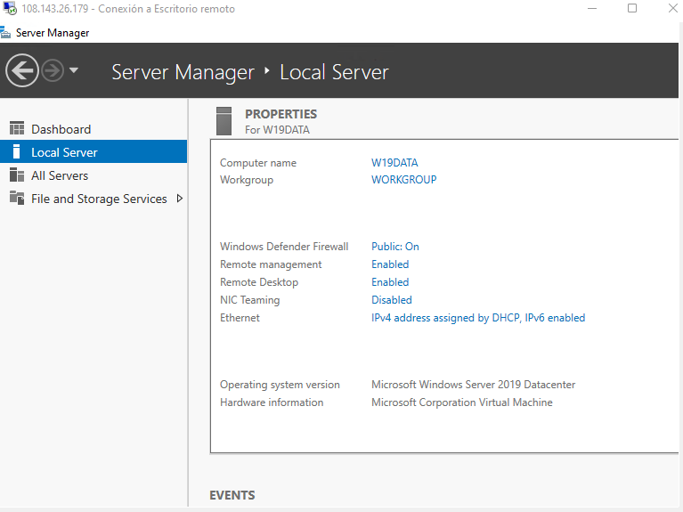

Añadimos una nueva regla al firewall predefinida de administración remota.

> No nos podemos conectar desde nuestro equipo local por temas de seguridad.

Ahora deberíamos poder entrar desde el portal Azure dentro de la máquina virtual --> Settings --> Windows Admin Center

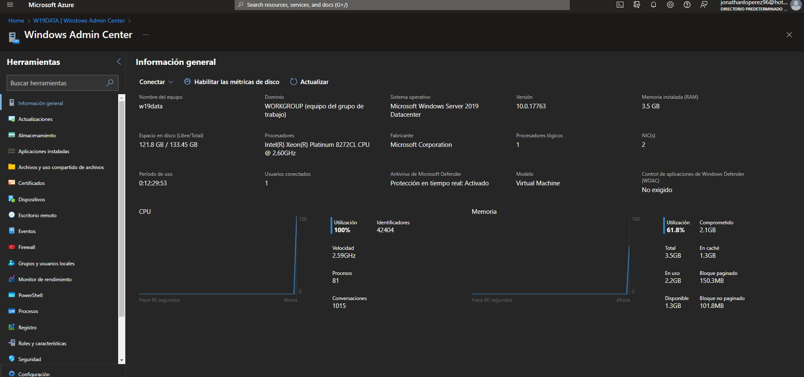

> Error: Si no carga comprueba las cookies.

## INSTALACIÓN DEL WEB SERVER

Vamos a instalar el rol de servidor Web en la máquina WIN19DATA.

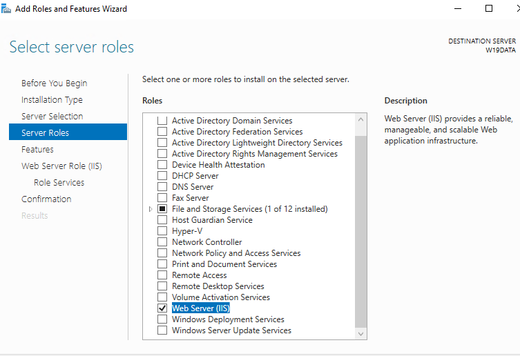

Una vez instalado podemos acceder desde cualquier lugar con la IP pública.

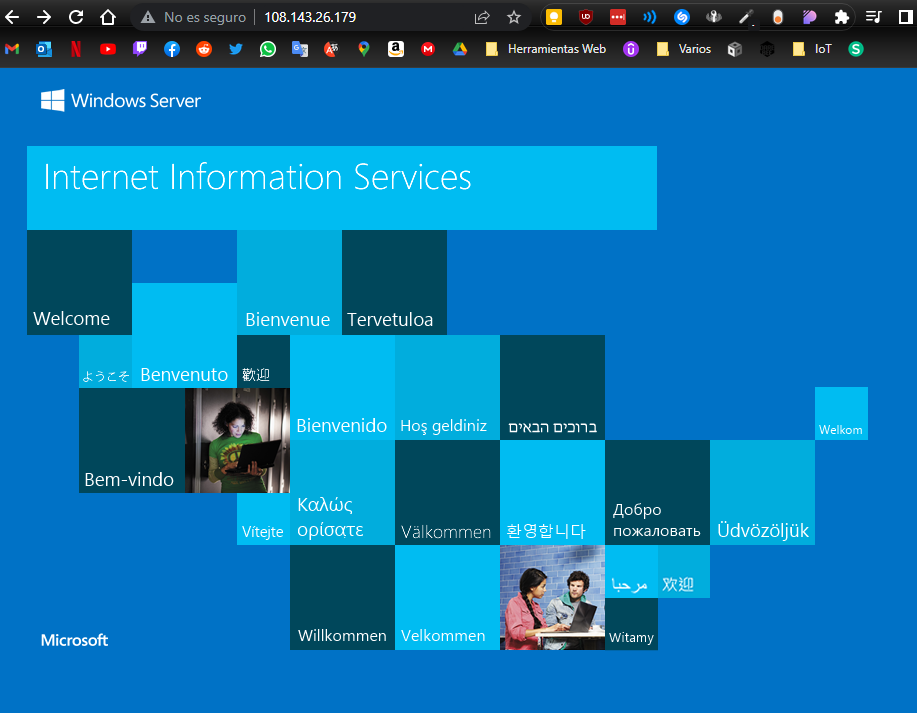

Ahora vamos a editar esa página vía SSH desde local con powershell.

> Hay que instalar primero OpenSSH server y client dentro de características opcionales.  
> Start-Service sshd  
> Set-Service -Name sshd -StartupType 'Automatic'

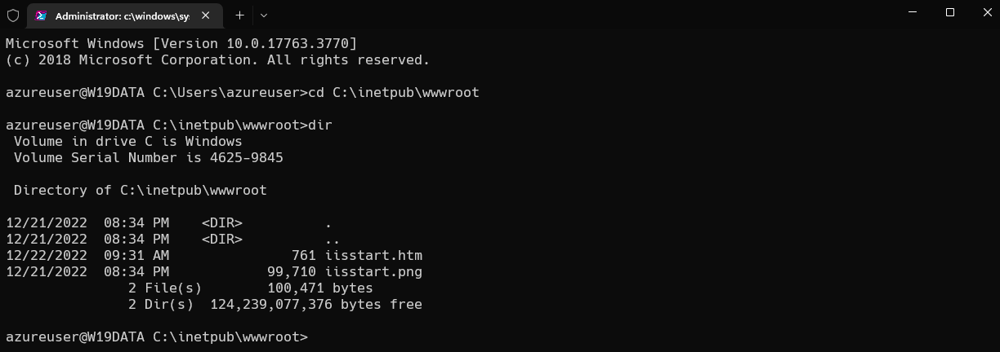

## GASTOS

Entramos en la subscription y miramos el balance actual.

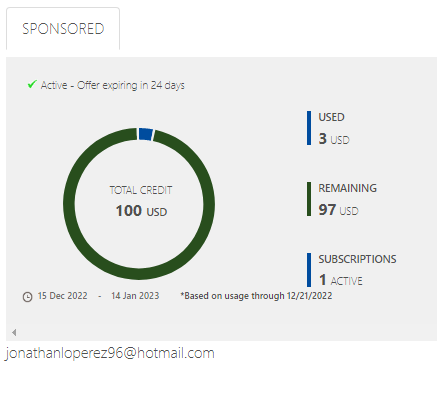
